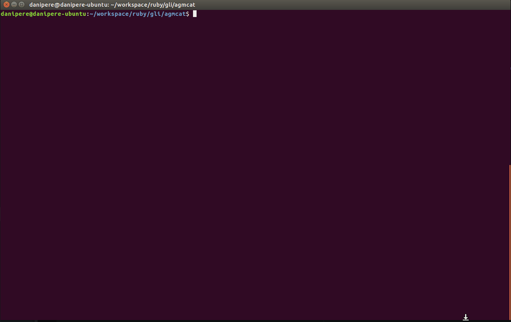

# Agmcat

A simple Ruby utility to migrate HPE Agile Manager user stories into GitHub issues. To test run 'bundle exec bin/agmcat'



## Installation

Execute the following:

```ruby
bundle install
```

## Usage

Run agmcat -h to see usage, shown below

```
NAME
    agmcat - Migrate HPE Agile Manager user stories to GitHub Issues.

SYNOPSIS
    agmcat [global options] command [command options] [arguments...]

VERSION
    0.0.1

GLOBAL OPTIONS
    -a, --agm_url=arg      - HPE AGM API URL (default: https://agilemanager-ast.saas.hp.com/agm)
    -c, --agm_id=arg       - HPE AGM client id (default: ********)
    -d, --agm_secret=arg   - HPE AGM client secret (default: ********)
    --help                 - Show this message
    -p, --proxy=arg        - HPE AGM client secret (default: http://web-proxy.corp.hpecorp.net:8080)
    -r, --github_repo=arg  - GitHub repository (default: http://github.com/dpmex4527/testAgmCat)
    -t, --github_token=arg - GitHub access token (default: ********)
    -u, --github_user=arg  - GitHub username (default: dpmex4527)
    --version              - Display the program version

COMMANDS
    help       - Shows a list of commands or help for one command
    initconfig - Initialize the config file using current global options
    inspect    - Inspect HPE AGM workspaces and releases.
    migrate    - Migrate user stories from HPE AGM into GitHub
```

## Configuration

Agmcat can take configuration variables in three ways

### Using flags

Run agmcat using provided GitHub and AGM flags when running commands, as show in --help

```
agmcat -a <AGM_API_URL> -c <AGM_CLIENT_ID> -d <AGM_CLIENT_SECRET> -u <GITHUB_USER> -t <GITHUB_API_TOKEN> -r <GITHUB_REPOSITORY> COMMAND
```

### Using environment variables

Export the following variables

```
export GITHUB_USER_NAME="<your-GitHub-username>"
export GITHUB_API_TOKEN="<your-super-secret-api-token>"
export GITHUB_REPOSITORY="http://github.com/dpmex4527/testAgmCat" (full URL path withou .git)
export AGM_API_URL="https://agilemanager-ast.saas.hp.com/agm"
export AGM_CLIENT_ID="<your-agm-client-id>"
export AGM_CLIENT_SECRET="<your-super-secret-agm-client-secret"
export HTTP_PROXY="<your-proxy-server>"
```

### Using initconfig command

Agmcat has a configuration command that will allow you to save required variables into a configuration file (stored in ~/.agmcat.rc in yaml format). Run the initConfig command with flags to store them for future use (default variables will be sourced from file)

```
agmcat -a <AGM_API_URL> -c <AGM_CLIENT_ID> -d <AGM_CLIENT_SECRET> -u <GITHUB_USER> -t <GITHUB_API_TOKEN> -r <GITHUB_REPOSITORY> -p <HTTP_PROXY> initconfig
```

Configuration file will be created in home directory

```
'/home/danipere/.agmcat.rc' written
```

Contents of the file should look like this:

```
---
:version: false
:help: false
:u: GITHUB_USER
:t: GITHUB_API_TOKEN
:r: ITHUB_REPOSITORY
:a: <AGM_API_URL
:c: AGM_CLIENT_ID
:d: AGM_CLIENT_SECRET
:p: HTTP_PROXY
commands:
  :_doc: {}
  :migrate: {}
  :inspect: {}
```

## Development

To run tests, rune "rake test".

#TODO: modify to run tests based on config file vars

## Contributing

Bug reports and pull requests are welcome on GitHub at https://github.com/dpmex4527/agmcat.


## License

The gem is available as open source under the terms of the [MIT License](http://opensource.org/licenses/MIT).
